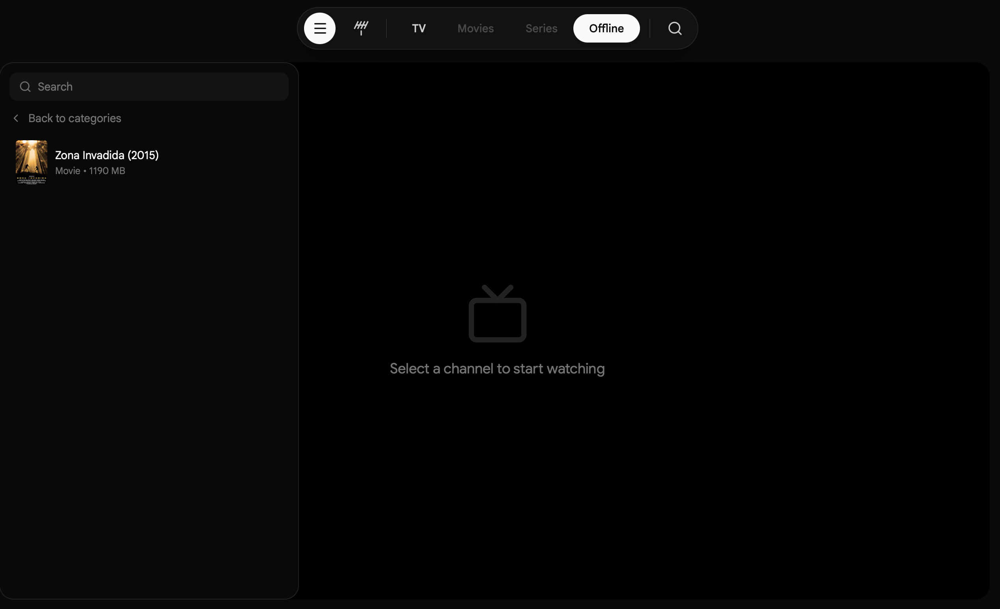
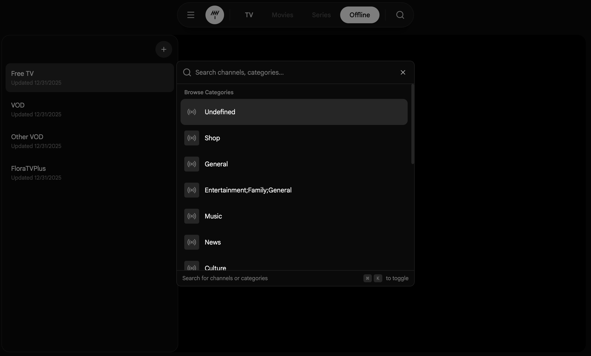

# WatchTV

A modern, experimental IPTV player built with **Tauri** and **React**. Designed with an Apple TV-inspired interface for a sleek viewing experience on macOS.

> ⚠️ **Experimental**: This project is under active development. Features may change or break.



## Features

- **Live TV Streaming** — Watch live IPTV channels with HLS and MPEG-TS support
- **Movies & Series** — Browse and play VOD content from your IPTV provider
- **Offline Playback** — Download movies and series to watch without internet
- **Spotlight Search** — Quick search with `⌘K` to find channels, movies, or categories instantly
- **Multiple Playlists** — Manage and switch between multiple IPTV playlists (M3U & Xtream Codes)
- **Smart Caching** — Playlist data is cached locally with SurrealDB for instant loading
- **Native macOS Experience** — Seamless window controls with overlay title bar



## Tech Stack

- **Frontend**: React, TypeScript, TailwindCSS, TanStack Router
- **Backend**: Tauri (Rust)
- **Database**: SurrealDB (RocksDB backend)
- **Video**: Plyr, HLS.js, mpegts.js
- **UI**: shadcn/ui, Motion (Framer Motion)

## Getting Started

### Prerequisites

- Node.js 18+
- Rust (latest stable)
- pnpm

### Development

```bash
# Install dependencies
pnpm install

# Run in development mode
pnpm tauri dev
```

### Build

```bash
# Build for production
pnpm tauri build
```

The built app will be in `src-tauri/target/release/bundle/`.

## Usage

1. Launch the app
2. Click "Get Started" to add your first playlist
3. Enter your M3U URL or Xtream Codes credentials
4. Browse channels, movies, and series
5. Use `⌘K` for quick search

## Keyboard Shortcuts

| Shortcut | Action |
|----------|--------|
| `⌘K` | Open spotlight search |
| `Space` | Play/Pause |
| `F` | Toggle fullscreen |
| `M` | Mute/Unmute |

## License

MIT
